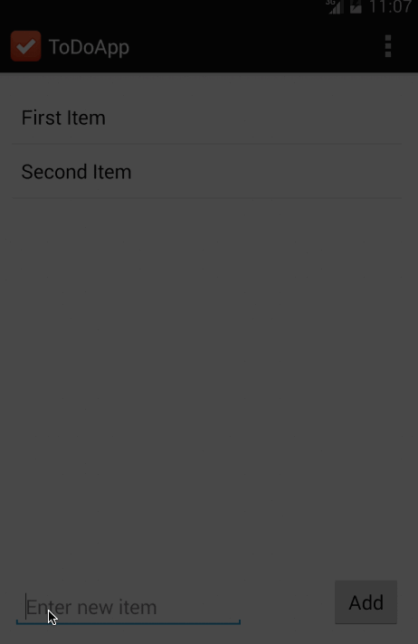
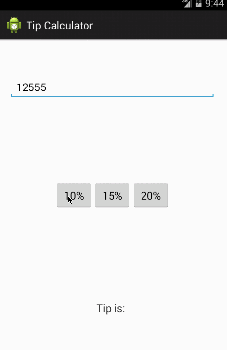

Todo App
===============

This is a pre-work app for Android Bootcamp preparation.

Time spent: 2 hours spent in coding

Completed user stories:

 * [x] Required: User can add item
 * [x] Required: User can remove item by long click
 * [x] Required: App can save item into file

Walkthrough of all user stories:

Tip Calculator App
===============

This is Week-1 homework app for Android Bootcamp.

Time spent: 2 hours spent in total

Completed user stories:

 * [x] User is displayed the tip of specified percentage for specified entered amount
 * [x] User enters the total amount of the transaction
 * [x] User can select between tip amounts (i.e 10%, 15%, 20%)
 * [x] Upon selecting tip amount, formatted tip value is displayed
 * [ ] Optional: User changes the total amount and updated tip is reflected automatically
 * [ ] Optional: User can select custom tip percentage if desired
 * [ ] Optional: User can select how many ways to split the tip
 * [ ] Optional: User can edit preset tip percentages and have them persist across launches
 * [ ] Optional: Experiment with trying input widgets to replace the buttons and/or textviews
 * [ ] Optional: Improve the user interface and experience by using images and/or colors

Walkthrough of all user stories:

GIF created with [LiceCap](http://www.cockos.com/licecap/).

