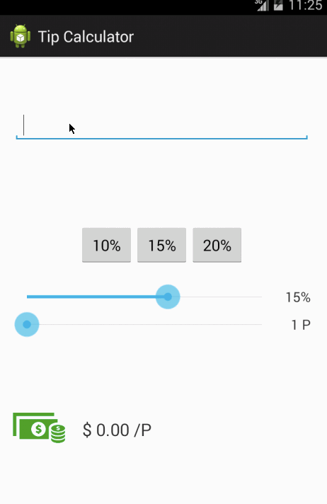

Todo App
===============

This is a pre-work app for Android Bootcamp preparation.

Time spent: 2 hours spent in coding

Completed user stories:

 * [x] Required: User can add item
 * [x] Required: User can remove item by long click
 * [x] Required: App can save item into file

Walkthrough of all user stories:

Tip Calculator App
===============

This is Week-1 homework app for Android Bootcamp.

Time spent: 5 hours spent in total (2 hours for required; 3 hours for optional stories)

Completed user stories:

 * [x] User is displayed the tip of specified percentage for specified entered amount
 * [x] User enters the total amount of the transaction
 * [x] User can select between tip amounts (i.e 10%, 15%, 20%)
 * [x] Upon selecting tip amount, formatted tip value is displayed
 * [x] Optional: User changes the total amount and updated tip is reflected automatically
 * [x] Optional: User can select custom tip percentage if desired
 * [x] Optional: User can select how many ways to split the tip
 * [x] Optional: User can edit preset tip percentages and have them persist across launches
 * [x] Optional: Experiment with trying input widgets to replace the buttons and/or textviews
 * [x] Optional: Improve the user interface and experience by using images and/or colors

Walkthrough of all user stories:

 

Instagram Client App
===============

This is Week-2 homework app for Android Bootcamp.

Time spent: 5 hours spent in total

Completed user stories:

 * [x] User can scroll through current popular photos from Instagram
 * [x] For each photo displayed, user can see the following details:
  * Graphic, Caption, Username
  * (Optional) relative timestamp, like count, user profile image
 * [ ] Advanced: Add pull-to-refresh for popular stream with SwipeRefreshLayout
 * [ ] Advanced: Show latest comment for each photo (bonus: show last 2 comments)
 * [ ] Advanced: Display each photo with the same style and proportions as the real Instagram
 * [ ] Advanced: Display each user profile image using a CircularImageView
 * [ ] Advanced: Display a nice default placeholder graphic for each image during loading (read more about Picasso)
 * [ ] Advanced: Improve the user interface through styling and coloring
 * [ ] Bonus: Allow user to view all comments for an image within a separate screen or a dialog fragment

Walkthrough of all user stories:

GIF created with [LiceCap](http://www.cockos.com/licecap/).
